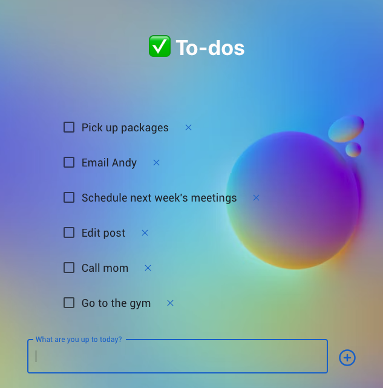

# To-do App

A task tracker that passes data between React components with React hooks and event handling to create, delete and mark tasks as complete. Incorporated responsive design principles and the MaterialUI framework.

🔗https://todo-app-jyw.netlify.app/

